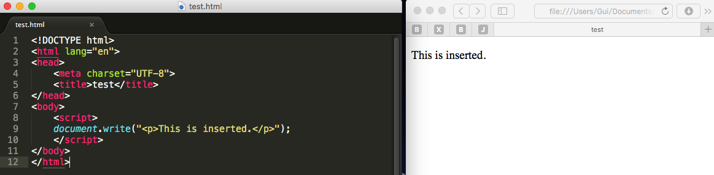

# head-first-html5-programming

（龟速更新中）
##数据类型
###字符串
####双引号和单引号
双引号单引号都可以

```
var test = "foo";
var test = 'foo';//这两句是一样的
```

```
var mood = "don't ask";
```
如果想要在上面的语句中使用单引号，需要对字符串don't中的单引号进行转义.对字符进行转义需要用到反斜杠符号“\”。

```
var mood = 'dont\'t ask';
```
###数值
整型

```
var age = 35;
```

浮点型

```
var age = 23.33;
```

负数

```
var temperature = -24.34;
```
###布尔值
布尔变量的值为true或false，需要注意不能带引号。

```
var sleeping = true;//布尔变量
var sleeping = "true";//字符串
```

###数组
使用Array声明一个数组

```
var beatles = Array(4);//四个元素的数组
var beatles = Array();//不定元素数量的数组
```
数组元素赋值

```
beatles[0] = "John";//从0开始
```
便捷方法

```
var beatles = Array("John", "Paul", "George", "Ringo");
var beatles = ["John", "Paul", "George", "Ringo"];//一个四个元素的数组
```

数组元素可以是不同类型

```
var stuff = [123,"你高兴就好",true];
```

数组下标可以是字符串

```
var lennon = Array();
lennon["name"] = "John";
lennon["year"] = 1940;
lennon["lining"] = false; //ps:这不是字典吗
```
数组的元素可以是另一个数组

```
var beatles = Array();
beatles[0] = lennon;
```

##操作
加法：字符串相加，会拼接字符串，字符串和数字相加，数字会转化为字符串，数字和数字相加，进行简单的算术运算

```
var message = 10 + 20; // = 30
var message = "10" + 20; // = "1020"
var message = "hello" + " world"; // = "hello world"
```
自增

```
var y = 1;
y++; // y=2
y += 1; //y=3
```

##条件语句

== 和 =

```
var k = 1;
if( k == 2) { // k不等于2，表达式“k == 2”求值结果为false
	//code
} else {
	//code
}
```
赋值语句的求值结果永远为true

```
var k = 1;
if( k = 2) { // k赋值为2，条件永远为真
	//code
}
```
##DOM
一份文档就是一棵节点树<br>
结点分为不同的类型：元素节点、属性节点、文本节点等<br>
`getElementById()`方法将返回一个<strong>对象</strong><br>
`getElementsBuTagName()`方法将返回一个<strong>对象数组</strong><br>
这些节点的每个，都是一个对象

###getAttribute()方法
```
var msg = document.getElementById("message");
alert(msg.getAttribute("id")); //显示："message"
```
###setAttrubite()方法
setAttribute(attributeName, value)

```
var shopping = document.getElementById("purchases");
shopping.setAttribute("title","a list of goods"); //shopping.title = "a list of goods"
```

使用`setAttrubite()`动态修改元素的属性，修改结果不会反映在源代码上，DOM的工作模式：先加载文档的静态内容，再以动态方式对他们进行刷新。

##事件处理函数
在给某个元素添加了事件处理函数后，一旦发生预定事件，相应的javascript 代码就会得到执行，那些javascript 代码可以返回一个结果，而这个结果将被传递回那个事件处理函数。
例如，我们可以给某个链接添加一个`onclick`事件处理函数，并让这个处理函数所触发的javascript 代码返回布尔值true或false。当这个链接被点击时，如果那段javascript 代码返回给`onclick`事件处理函数的值是true，`onclick`事件处理函数将认为“这个链接被点击了”，反之，在一个`<a>`元素的`onclick`属性中添加`return false;`，`onclick`事件处理函数认为“这个链接没有被点击”。所以链接不会被打开

##childNodes属性
`childNodes`属性让我们可以从给定文档的节点树里把任何一个元素的所有子元素检索出来.childNodes属性将返回一个数组

```
element.childNodes
```

##nodeType
<br>
<span style="font-size:70px; background:#777; border-radius:5px; color:white; margin-left:1em;">晚点再加...</span>
##nodeValue
如果想要提取、改变某个元素（如：`<p>`元素）的文本，可以使用nodeValue。

```
//description是一个<p>元素
alert(description.nodeValue); // = null
//包含在<p>元素的文本是另一种节点，它在DOM里是<p>元素的第一个子节点。换句话说，想要获得<p>元素的文本内容，就必须检索它的第一个子节点的nodeValue属性值。
alert(description.childNodes[0].nodeValue);// = descriptionText
```

`childNodes[0]`通常用`firstChild`代替

#最佳实践
##伪协议

- 尽量不使用`javascript:`伪协议
- 不要这样写：`href="#"`

###`addLoadEvent()`
需要在window.onload中执行多个函数时，用一个统一的函数处理

```
function addLoadEvent(func) {
	var oldload = window.onload;
	if (typeof window.onload != 'function') {
		window.onload = func;
	} else {
		window.onload = function() {
			oldload();
			func();
		}
	}
}

addLoadEvent(functionA);
addLoadEvent(functionB);
```


##脚本的插入位置
脚本在标记中的位置对页面的初次加载时间有很大影响。一般我们把脚本放在文档的`<head>`区域。这种方法的一个问题是：位于`<head>`块中的脚本会导致浏览器无法并行加载其他文件，如其他脚本或图像。根据http规范，浏览器每次从同一个域名中最多只能同时下载两个文件。而在下载脚本期间，浏览器不会下载其他任何文件。即使是来自不同域名的也不会下载。所有其他资源都要等脚本加载完才会下载。把所有的`<script>`标签都放到文档的末尾，`</body>`标记之前，就可以让页面变得更快。

###document.write()


##window.onload

```
window.onload = init;
function init() { //通常需要在页面完全加载完之后再执行js代码,因为页面没加载完，DOM都没有，你执行个蛋？
var planet = document.getElementById("greenplanet");
planet.innerHTML = "Red Alert: hit by phaser fire!";
}
```
##插入元素到DOM
```
var songItem = document.createElement("li");//新建元素，传入类型
songItem.innerHTML = songName;//设置新元素的文本，用innerHTML
var playlist = document.getElementById("playlist");//获取希望插入的元素
playlist.appendChild(songItem);//用appendChild()函数把新元素插入到希望插入的元素 
```
##局部变量和全局变量
```
函数体外声明的，是全局变量
var avator;
var levelThreshold = 1000;//全局变量,页面链接到其它脚本，它们也会看到这些全局变量
function getScore(points) {
	var score; //局部变量
	for (var i = 0; i < levelThreshold; i++) {
		//code here	
	}
return score;
}

var beanCounter = 10; //全局变量

function getNumberOfItems(ordertype) {
	var beanCounter = 0;  //和全局变量同名，将在此函数体内覆盖全部变量
	if (ordertype == "order") {
		//do some stuff with beanCounter...
	}
	return beanCounter;
}
```
##函数
```
function addOne (num) {
	return num + 1;
}
var plusOne = addOne; //把addOne赋到一个新变量plusOne
var result = plasOne(1); //plasOne赋为一个函数，所以可以调用它并提供一个整型参数1
```
###函数可以没有名字
```
function(num) {
	return num + 1;
}
//同样地，把这个匿名函数赋给一个变量
var f = function(num){
	return num + 1;
}
//然后可以使用这个变量来调用函数
var result = f(1);
```
###将函数作为值能够做什么
```
function init() {
	alert("you rule!");
}
window.onload = init; //如果函数名后面使用了小括号，比如init()，就是说你希望调用函数init。如果只是使用名字而没有小括号，就会把这个函数值赋给onload属性。
//直接把一个匿名的函数赋给window.onload属性
window.onload = function() {
	alert("you rule!");
}
```

##创建对象
```
//将对象赋至一个变量时，会向变量提供这个对象的引用。它并不“保存”对象本身,所以，调用一个函数并传入一个对象时，实际上只是传递了对象引用－－类似于一个指针。这个引用的副本会传递到形参，它指向原来的对象
var fido = {
	name: "Fido", //类似字典的组织方式，中间用逗号间隔，！！！逗！！！号！！！不是分号！！！
	weight: 40,
	breed: "Mixed",
	loves:["walks", "fetching balls"]//最后一个属性不用加逗号了，嗯
}; //别看它这么长，占了4行，这实际上还是一个赋值语句，需要加分号。
```
###可以用对象做的一些事情
```
if (fido.weight > 35) { //点语法访问对象属性
	alert("WOOF");
} else {
	alert("yip");
}

var breed = fido["breed"] //类似字典的key-value风格访问对象属性
if (breed = "mixed") {
	alert("Best in show");
}

fido.weight = 70; //改变对象属性
fido.breed = "Chawalla/Great Dane mix";
fido.loves.push("Chewing bones"); //向对象属性（数组）增加元素，使用push()函数

var prop;
for (prop in fido) { //枚举对象属性
	alert("Fido has a " + prop + "property ");
	if (prop == "name") {
		alert("This is " + fido[prop]);
	}
}

var likes = fido.loves; //处理对象数组
var likeString = "Fido likes ";
for (var i = 0; i < likes.length; i++) {
	likeString += likes[i];
}
alert(likeString);

function bark(dog){ //向函数传入一个对象
	if (dog.weight > 25) {
		alert("WOOF");
	} else {
		alert("yip");
	}
}
bark(fido);

//任何时刻都可以增加或删除属性
//要向一个对象增加属性，只需要为一个新属性赋一个值
fido.age = 5; //从现在开始，fido就有了一个age属性
delete fido.age;//删除一个对象的属性,删除成功delete表达式会返回true

function loseWeight(dog) {
	dog.weight = dog.weight - 10;
}

loseWeight(fido); //把fido传入loseWeight时，赋给dog形参的是引用的一个副本（fido是对象的一个引用），而不是对象的副本，所以fido和dog指向同一个对象。
```
###对象中的函数
```
var baby = {
	name: "Fido",
	weight: 40,
	breed: "Mixed",
	loves:["walks", "fetching balls"],
	//对象也可以有函数：对象中的函数，叫做方法
	bark : function(){
		alert("WOOF!!!");
 		}
};

//调用对象中的方法
baby.bark();

var movie3 = {
	name:"Planet 2333",
	type:"KeHuanPian",
	level:3,
	showTime:["5:00am","6:30pm","9:00pm"],
	getNextShowing:function() {
		var now = new Date().getTime();
		//对象中的方法要使用this关键字访问对象自身的属性。相当于Objective－C的self
		for (var i = 0;i < this.showTime.length; i++) {
			var showtime = getTimeFromString(this.showTime[i]);
			if ((showtime - now) > 0) {
				return "Next showing of " + this.name + " is " + this.showTime[i];
			}
		}
		return null;
	}
};

var newNextShowing = movie3.getNextShowing();
alert(newNextShowing);

//按照144行的方式构造一个movie对象，每一个movie对象都会有一大段重复的getNextShowing方法代码
// 这里可以使用***构造函数***来解决
//构造函数的名字，按照约定，首字母要大写，形参取我们希望的对象属性值
function Dog(name, breed, weight) { //可以想象成Objective－C里的 initWithName:Breed:Weight
	this.name   = name;
	this.breed  = breed;
	this.weight = weight;
	this.bark   = function(){
		if (this.weight > 25) {
			alert(this.name + " says WOOF!");
		} else {
			alert(this.name + "says Yip!");
		}
	};
}

	//调用构造函数前要加上关键字new
	var krake     = new Dog("Krake","Mixed",47);
	var tiny      = new Dog("Tiny","Chawalla",8);
	var clifford  = new Dog("Clifford","Bloodhound",65);

krake.bark();//一旦得到对象，就可以调用它们的bark方法让每个Dog叫
	tiny.bark();
	clifford.bark();

	//构造movie
	function Movie(title, genre, rating, showtimes) {
		this.title          = title;
		this.genre          = genre;
		this.rating         = rating;
		this.showtimes      = showtimes
		this.getNextShowing = function(){
			var now = new Date().getTime();
			for (var i = 0; i < this.showtimes.length; i++) {
				var showtime = getTimeFromString(this.showtimes[i]);
				if ((showtime - now) > 0) {
					return "Next showing of " + this.title + " is " + this.showtimes[i];
				}
			}
		};
	}

var krakeMovie = new Movie("泰坦尼克号","爱情动作片",5,["3:00pm","5:00pm","8:00pm"]);
//window对象相当于全局环境，所以alert()不加 window. 前缀也可以顺利解析
alert(krakeMovie.getNextShowing());
```
##第五章-爸爸去哪儿（地理位置API）
###Geolocation.getCurrentPosition()函数
```
function getMyLocation() {
	if (navigator.geolocation) { //利用这个检查确保浏览器支持地理定位API，如果存在这个对象，说明浏览器支持这个API
	//当geolocation确定了你的位置，就会调用传入的这个函数
	navigator.geolocation.getCurrentPosition(displayLocation, displayError,options);//追踪位置时需要注释这一行，添加下面4行 //displayLocation函数就是将要操纵位置的处理程序
	} else {
		alert("Oops, no geolocation support");
	}
}
```
###成功处理函数success handler
```
function displayLocation(position) {//浏览器得到一个位置时就会调用这个函数。getCurrentPosition会传递一个位置（position对象）到这个函数，包含经度和纬度
	var latitude  = position.coords.latitude;
	var longitude = position.coords.longitude;

	var div = document.getElementById("location");
	div.innerHTML = "You are at Latitude: " + latitude + ", Longitude: " + longitude; 
	div.innerHTML += "(with " + position.coords.accuracy + " meters accuracy)";//精度
	div.innerHTML += "(found in " + options.timeout + " milliseconds)";

	var km = computeDistance(position.coords, ourCoords);//计算距离
	var distance = document.getElementById("distance");
	distance.innerHTML = "You are" + km + "km from the wickedlySmart HQ";
}
```
###失败处理函数failed handler
```
function displayError(error) { //geolocation会在确定位置失败时向这个函数传入一个error对象。其中包含一个数值码，描述了未能确定浏览器位置的原因。
	var errorType = {
		0: "Unknown error",
		1: "Permission denied by user",
		2: "Position is not available",
		3: "Request timed out"
	};
	var errorMessage = errorType[error.code];//error对象有一个code属性，其中包含一个0-3的数。根据code属性的不同，把一个错误消息串赋给一个新变量

	if (error.code == 0 || error.code == 2) {
		errorMessage = errorMessage + " " + error.message;
	}

	var div = document.getElementById("location");
	div.innerHTML = errorMessage;

	options.timeout += 100;
	navigator.geolocation.getCurrentPosition(displayLocation,displayError.options);
	div.innerHTML += "...checking again with timeout= " + options.timeout;
}
```
###getCurrentPosition的第三个参数：
```
var positionOptions = {
	enableHighAccurary: false, //是否开启高精度
	timeout: Infinity, //超时时长
	maximumAge:0 //缓存时间，例如，设置为60000 （60s），60秒内第二次求位置会返回原来的值，不会重新求
}
```
###追踪位置
```
var watchId = null; //通过这个id来clear追踪状态

function watchLocation(){
	watchId = navigator.geolocation.watchPosition(displayLocation, displayError);
	alert("正在追踪位置");
}

function clearwatch() {
	if (watchId) {
		navigator.geolocation.clearWatch(watchId);
		watchId = null;
		alert("停止追踪位置");
	}
}
```
##第六章

###如何从javascript创建请求
####XMLHttpRequest

```
var url = "http://someserver.com/data.json"; //创建一个目标url,告诉浏览器要到哪里找我们想要的数据
var request = new XMLHttpRequest(); //创建一个XMLHttpRequest请求对象
request.open("GET",url)//这个request对象将使用GET方式获取url的请求。open用一个URL建立一个请求，并告诉这个请求对象要使用哪种请求，以便XMLHttpRequest验证连接。
request.onload = function() { //数据到达时，调用这个处理函数
	if (request.status == 200) { //http响应码200表示请求没有错误
		alert(request.responseText);//HTTP GET获取到数据可以在request对象的responseText属性中找到
	}
};
request.send(null); //告诉请求对象去获取数据。send()会把请求发送到服务器，如果不打算发送任何数据，就传入null。
```

###JSON
####JSON.stringify()把数据转化为json格式
```
var plan9Movie = new Movie("Plan 9 from Outer Space","Cult Classic",2,["3:00pm","5:00pm","11:00pm"]); //创建一个对象
var jsonString = JSON.stringify(plan9Movie);//转化为json格式的串
alert(jsonString);
```
####JSON.parse()把json数据转化为javascript对象
```
var jsonObject = JSON.parse(jsonString);//json串转化为对象
alert("JSON movie is " + jsonObject.title);
```	
###tips:
如何[在Mac上启动localhost本地服务器](http://coolestguidesontheplanet.com/get-apache-mysql-php-and-phpmyadmin-working-on-osx-10-11-el-capitan/)

```
window.onload = function() {
	//var url = "http://gumball.wickedlysmart.com";
	var url = "http://localhost/sales.json"; //测试时需要在浏览器输入http://localhost/mightygumball.html,直接打开mightygumball.html将无法获取json数据
 	var request = new XMLHttpRequest();
 	request.open("GET", url);
 	request.onload = function() {
 		if (request.status == 200) {
 			updateSales(request.responseText);
 		}
 	};
 	request.send(null);
}

function updateSales(responseText) {
 	var salesDiv = document.getElementById("sales");
 	var sales = JSON.parse(responseText); //转化为javascript对象
 	for (var i = 0; i < sales.length; i++) { //迭代处理每一个数组元素
 		var sale = sales[i];
 		var div = document.createElement("div"); //对每个元素，创建一个div，设置class属性以便css调整样式
 		div.setAttribute("class","saleItem");
 		div.innerHTML =  sale.name + " sold " + sale.sales + " gumball";
 		salesDiv.appendChild(div);
 	}
}
```
	
##浏览器安全策略
	
###javascript 代码可以接受的行为
	用户对一个页面（blablabla.com）作出请求
	页面需要得到blablabla.com的一些数据，所以对这些数据作出XMLHttpRequest
###javascript 代码不能接受的行为(XMLHttpRequest跨域请求)
	浏览器对blablabla.com上的一个页面作出请求
	代码希望从一个来源得到数据，也就是hehehe.com，嗯，这是不！！行！！的！！
	XMLHttpRequest向hehehe.com请求数据-->浏览器看的这个请求指向与页面不同的域，就会停下，请求被拒绝-->blablabla.com的服务区根本没有看到请求，在它看到请求之前，浏览器的安全策略已经中止了这个请求
	（简单地说，你丫百度的跑来我大谷歌请求数据？滚！！！）
	
###JSONP-一种使用`<script>`获取数据的方法

>*浏览器不允许你对原先提供页面的域以外的其他域发出XMLHttpRequests请求*

>*如果从某个域提供页面，安全策略要求不能从另一个域获取数据*

当我们需要从其他域获取数据时，可以这样：

`mightygumball.html`

	<!doctype html>
	<html lang="en">
	<head>
		<title>Mighty Gumball</title>
		<meta charset="utf-8">
		<script src="mightygumball.js"></script>
		<link rel="stylesheet" href="mightygumball.css"> 
	</head>
	
	<body>
		<h1>Mighty Gumball Sales</h1>
		<div id="sales">
		</div>
		<script src="http://gumball.wickedlysmart.com／gumball/gumball.com/?callback=updateSales"></script><!--链接外部javascript-->
	</body>
	</html>
	
解析到数据后回调updateSales函数进行处理(`?callback=updateSales`)

`mightygumball.js`

	function updateSales(sales) { //返回的新数据不再是一个json串，而是一个对象。
	 	var salesDiv = document.getElementById("sales");
	
	 	for (var i = 0; i < sales.length; i++) { //迭代处理每一个数组元素
	 		var sale = sales[i];
	 		var div = document.createElement("div"); //对每个元素，创建一个div，设置class属性以便css调整样式
	 		div.setAttribute("class","saleItem");
	 		div.innerHTML =  sale.name + " sold " + sale.sales + " gumball";
	 		salesDiv.appendChild(div);
	 	}
	}
####安全问题
如果向一个恶意web服务发出一个JSONP请求，响应中可能包含你不想要的代码，而且浏览器会执行这些恶意代码。所以在链接前需要确保信任这个服务。

###定时器
####setInterval(handleRefresh,timeInterval)方法
```
setInterval(imfire, 3000);//每隔3秒钟，执行一次imfire函数

function imfire(){
	alert("I'm fire!");
}
```

###动态插入`<script>`元素
`setInterval(handle, interval)`

`getElementsByTagName(tag)`

`replaceChild(new,old)`

`setAttribute(attributeName, value)`

载入脚本，调用`setInterval()`

```
window.onload = function() {
	var url = "http://gumball.wickedlysmart.com／gumball/gumball.com";
	setInterval(refresh, 3000); //setInterval()返回一个id标识这个定时器，把这个id保存在一个变量里，以后可以通过传递id到clearInterval方法停止它
}
```
`setInterval()`调用`refresh()`

如果多次请求，可以在JSONP请求URL的末尾使用一个随机数（这是是random=blablabla），使浏览器不会缓存这个相应

```
function refresh() {
	var url = "http://gumball.wickedlysmart.com／gumball/gumball.com/?callback=updateSales" + "&lastreporttime" + lastReportTime + "&random=" + (new Date()).getTime(); //url放在这里
	var newScriptElement = document.createElement("script");//新建一个script元素
	newScriptElement.setAttribute("src",url);//设定新script的src和id
	newScriptElement.setAttribute("id","jsonp");

	var oldScriptElement = document.getElementById("jsonp");//看看有没有这个元素
	var head = document.getElementsByTagName("head")[0]; //返回与给定标记名匹配到元素数组
	if (!oldScriptElement) {//如果没有
		head.appendChild(newScriptElement); //增加到head
	} else {//如果已经存在
		head.replaceChild(newScriptElement, oldScriptElement); //替换掉 -->replaceChild(new, old)
		//如果只是用新的url替换src属性，浏览器不会把它当做一个新元素，所以不会发出请求，要强制浏览器作出请求，必须创建这个全新的script元素。替换掉整个<script>元素。这种技术称为“脚本插入”
	}
}
```
脚本插入后调用url里传入的回调函数`updateSales`

```
function updateSales(sales) { //返回的新数据不再是一个json串，而是一个对象。
 	var salesDiv = document.getElementById("sales");

 	for (var i = 0; i < sales.length; i++) { //迭代处理每一个数组元素
 		var sale = sales[i];
 		var div = document.createElement("div"); //对每个元素，创建一个div，设置class属性以便css调整样式
 		div.setAttribute("class","saleItem");
 		div.innerHTML =  sale.name + " sold " + sale.sales + " gumball";
 		salesDiv.appendChild(div);
 	}
 	if (sales.length > 0) {
 		lastReportTime = sales[sales.length -1].time;
 	}
}
```